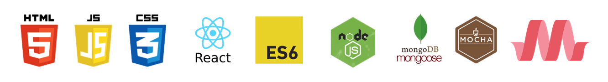
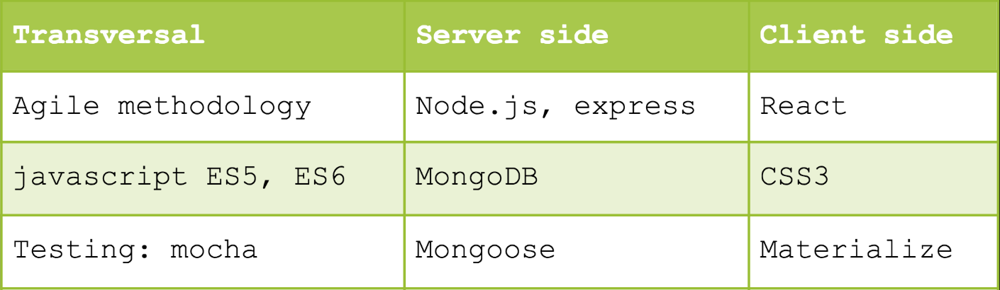
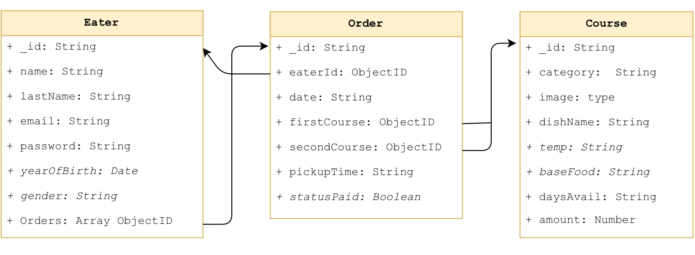
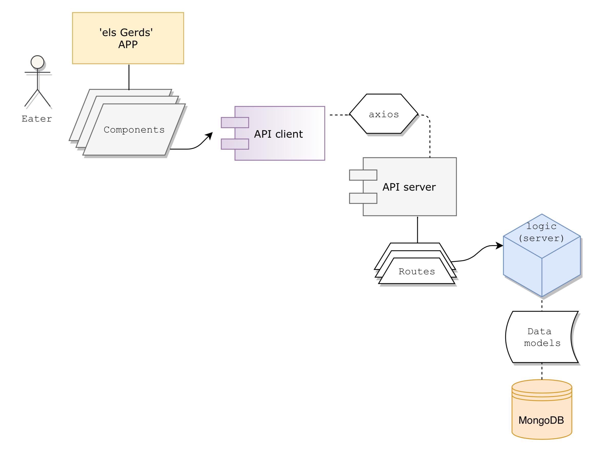
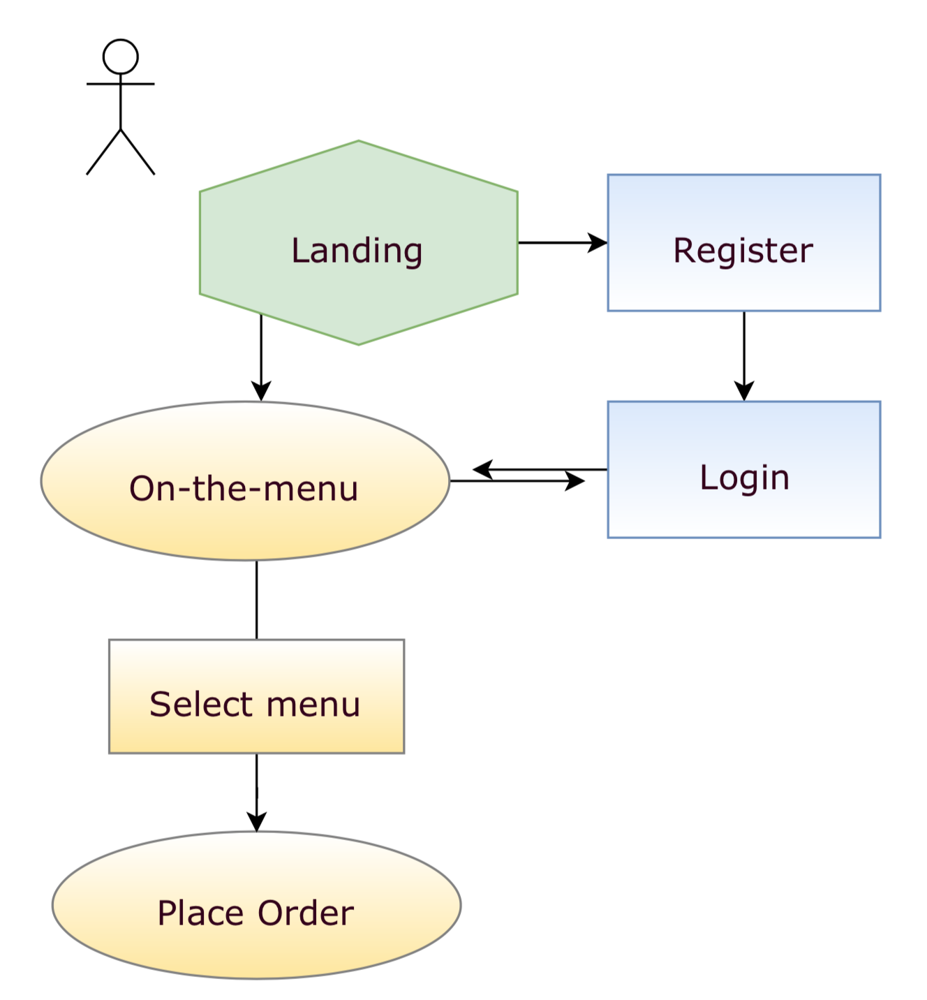
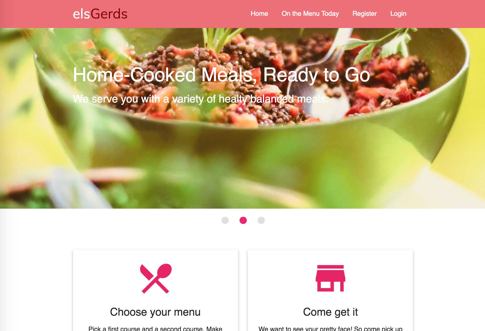
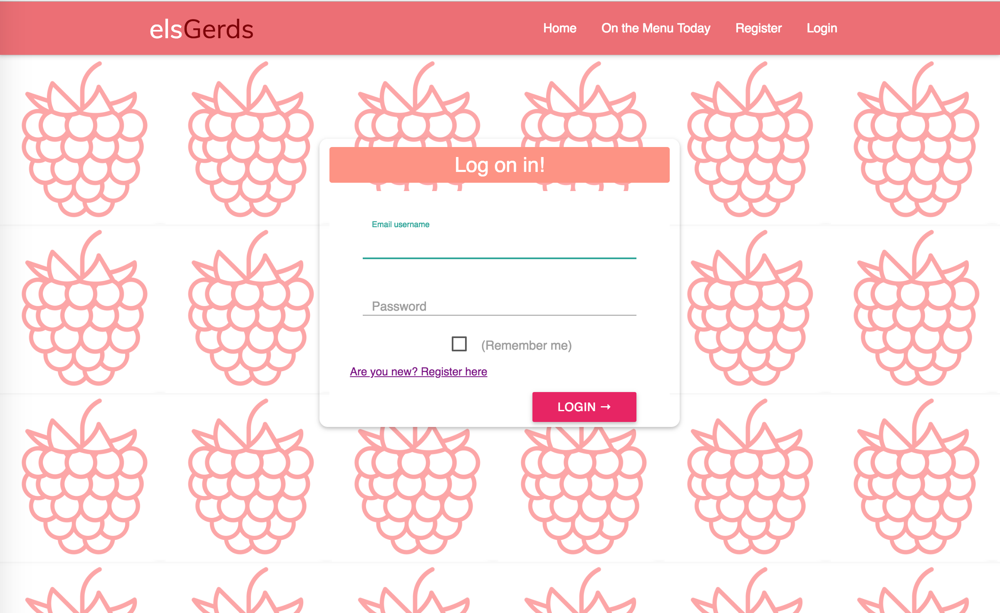
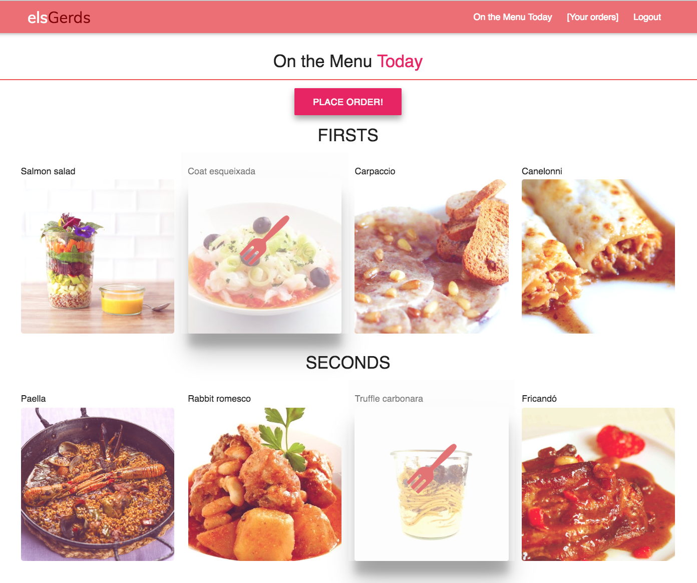
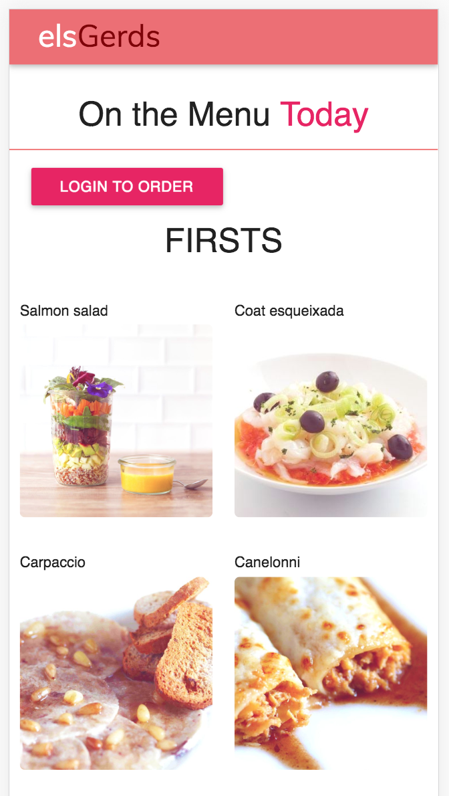
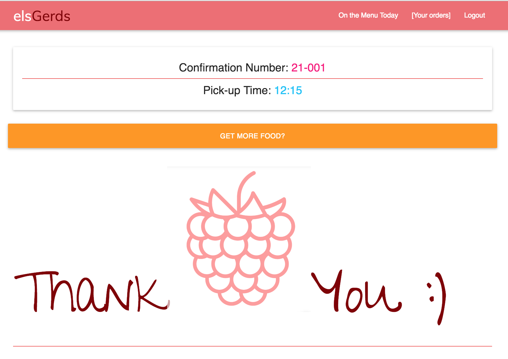

# els Gerds - Project App

# 

## App description

This project is based on an actual store that sells home-cooked meals for lunch. The main purpose of this app is on one hand, to help the store manage their orders on a daily basis. On the other hand, the customer would be avoiding lines and planning their meals ahead. It is not quite an e-commerce since it targets lunch meals only on a daily basis and there's no delivery.

For now, the only functionality of this app is to place same-day lunch orders. 

## TECHNOLOGIES

- Others: git & github, surge, heroku, cloudinary, draw.io. 

## DATA MODELS

## BLOCK MODELS

## USE CASES

## DESIGN (screenshots)
### Landing Page

### Login Page

### On-The-Menu Page

### Order Page

### Order Confirmation Page

## Technical Steps to Start App in Local

1. SERVER side (back end):

Install dependencies and modules from package.json. Use command "npm install" on each of the folders:
    -server/data
    -server/logic
    -server/api

START SERVER on localhost from server/api. Command: nodemon .

2. CLIENT side (front end):

Install dependencies and modules from package.json. Use command "npm install" on each of the folders:
    -client/api
    -client/app (React)

START REACT APP on browser from client/app. Command: npm start

## APP URL 

http://elsgerds.surge.sh/#/

-----------
                            Indra Roura, June 2018

